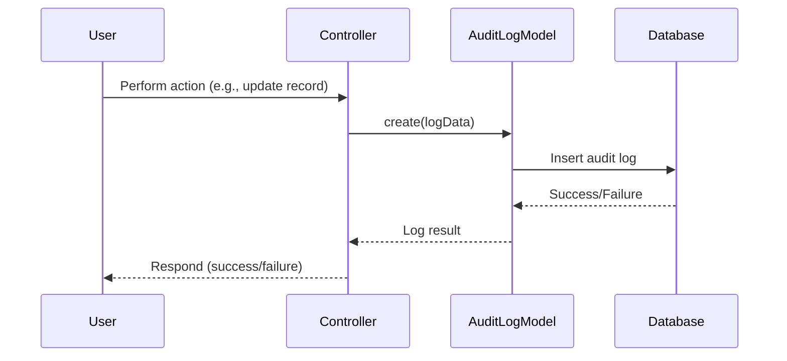

# AuditLog Module Documentation

## Overview

The **AuditLog** module is designed to provide a robust and flexible way to record, store, and retrieve audit logs within the application. It helps track changes, actions, and events performed by users or system processes, ensuring transparency and accountability for critical operations.

---

## Design Philosophy: Generic, Document-Based Ledger

Ideally, the AuditLog (or ledger) structure should be highly generic and reusable across all sites and modules. The main goal is to record all relevant changes to a specific entity in a way that is easy to query and analyze directly from the application's UI.

### Key Objectives
- **Empower users/admins** to answer:
  - "What happened?"
  - "Who did it?"
  - "When did it happen?"
  - "What changed?"
  without developer intervention, and in a timely manner.

### Document-Based vs. Table-Based
The preferred structure for the ledger is **document-based** rather than rigid SQL tables. This flexible approach allows each record to represent an event—a specific instance of a change to an entity. Each event has a `type`, and the types of events can vary greatly by entity, making the ledger contextually tied to the entity it refers to.

#### Why Document-Based?
- **Flexibility:** Easily adapt to new event types and data structures as requirements evolve.
- **Rich Context:** Store all relevant details for each event in a single, queryable document.
- **Scalability:** Accommodate a wide variety of entities and event types without schema changes.

#### Example Event Record Structure
```json
{
  "uuid": "...",
  "entity_type": "User",
  "entity_id": 123,
  "type": "update",
  "admin_uuid": "...",
  "timestamp": "2025-08-06T12:34:56Z",
  "changes": {
    "email": ["old@example.com", "new@example.com"]
  },
  "context": {
    "ip": "192.168.1.1",
    "user_agent": "..."
  }
}
```

---

### Key Features

- Generic, document-based structure for maximum flexibility
- Stores audit logs in the `audit_logs` database table
- Supports structured log data (JSON array/object)
- Associates logs with administrators via `admin_uuid`
- Timestamps for creation and updates
- Easily extendable for custom logging needs

## Database Structure

| Field        | Type    | Description                        |
|--------------|---------|------------------------------------|
| uuid         | string  | Unique identifier for the log entry |
| log          | array   | The log data (JSON)                |
| admin_uuid   | string  | UUID of the admin performing action |
| created_at   | datetime| Log creation timestamp             |
| updated_at   | datetime| Log update timestamp               |

## Model Structure

The `AuditLog` model extends Laravel's Eloquent `Model` and provides the following configuration:
- **Table:** `audit_logs`
- **Timestamps:** Disabled (handled manually)
- **Fillable:** `uuid`, `log`, `admin_uuid`, `created_at`, `updated_at`
- **Guarded:** `created_at`, `updated_at`
- **Casts:** `log` as `array`

## Typical Audit Logging Flow

Below is a high-level flowchart and sequence diagram illustrating how the AuditLog module is typically used in the application.

---

## Flowchart

```mermaid
flowchart TD
    A[User/Admin performs action] --> B[Application triggers audit event]
    B --> C[AuditLog::create() called]
    C --> D[Log data validated & formatted]
    D --> E[Audit log saved to DB]
    E --> F[Action continues or response sent]
```

---

## Sequence Diagram



---

## Example Usage

```php
use Cardinal\Laravel\Api\AuditLog\Models\AuditLog;

AuditLog::create([
    'uuid' => (string) Str::uuid(),
    'log' => [
        'action' => 'update',
        'entity' => 'User',
        'entity_id' => 123,
        'changes' => [
            'email' => ['old@example.com', 'new@example.com']
        ],
    ],
    'admin_uuid' => $adminUuid,
    'created_at' => now(),
    'updated_at' => now(),
]);
```

---

## Extending the AuditLog Module

- Add additional fields to the `audit_logs` table as needed
- Customize the `log` structure for your application's requirements
- Integrate with Laravel events or observers for automatic logging

---

## Additional Diagrams

### Component Diagram

```mermaid
componentDiagram
    Application --> AuditLogModel
    AuditLogModel --> Database
```

---

## Conclusion

The AuditLog module is a foundational component for tracking and auditing actions within the application. It is designed for flexibility, security, and ease of integration, making it suitable for a wide range of audit logging needs.
